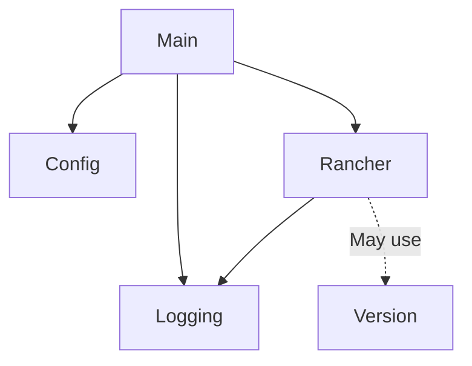

# Codebase Summary: Rancher Projects

## Overview
The Rancher Projects codebase is a Go application designed to manage Rancher Kubernetes cluster resources, specifically projects and namespaces. It follows a modular design with clear separation of concerns across packages.

## Project Structure

```
rancher-projects/
├── .gitignore
├── .golangci.yml        # Linting configuration
├── Dockerfile           # Container build definition
├── go.mod               # Go module definition
├── go.sum               # Go module checksums
├── LICENSE              # Project license
├── main.go              # Application entry point
├── rancher-projects.sh  # Shell script interface
├── README.md            # Project documentation
└── pkg/                 # Package directory
    ├── config/          # Configuration handling
    ├── logging/         # Logging setup
    ├── rancher/         # Rancher API interactions
    └── version/         # Version information
├── rancher-projects-action/ # GitHub Action
    ├── action.yml       # Action definition
    └── entrypoint.sh    # Action entry point
├── memory-bank/         # Project context documentation
├── cline_docs/          # Supplementary documentation
```

## Component Description

### Main Application (main.go)
- Serves as the entry point for the application
- Initializes configuration using the config package
- Sets up logging using the logging package
- Coordinates flow between verifying Rancher access and handling cluster operations
- Determines whether to process a single cluster or multiple clusters based on configuration

### Configuration Package (pkg/config)
- Handles command-line argument parsing
- Defines and validates configuration structure
- Provides configuration data to other components
- Implements help and usage information

### Logging Package (pkg/logging)
- Configures and initializes the logging system
- Uses logrus for structured logging
- Provides consistent logging interface across the application

### Rancher Package (pkg/rancher)
- Implements core functionality for Rancher API interactions
- Handles authentication and access verification
- Provides functions for cluster, project, and namespace operations
- Implements both single-cluster and multi-cluster workflows

### Version Package (pkg/version)
- Manages version information
- Stores build metadata (version, commit, build time)
- Provides version reporting functionality

### Deployment Options
- Shell script (rancher-projects.sh) for direct execution
- Docker container via Dockerfile
- GitHub Action for CI/CD integration

## Data Flow

1. **Configuration Initialization**:
   - Command-line arguments → Config package → Configuration structure
   
2. **Core Execution Flow**:
   ```
   Main → Config Initialization → Logging Setup → Rancher API Verification → Cluster Operations
   ```

3. **Cluster Operations Path**:
   - Single cluster: Direct operation on specified cluster
   - Multi-cluster: Filtering by type or labels → Operations on each matching cluster

## Dependencies

### External Dependencies
- github.com/sirupsen/logrus v1.9.3 (logging)
- github.com/stretchr/testify v1.10.0 (testing)

### Internal Dependencies


## Recent Changes
- Memory Bank documentation system established (March 2025)
- Documentation structure created (March 2025)
- Version package identified and documented

## Code Quality
- Uses golangci-lint for code quality (configured in .golangci.yml)
- Includes test framework with testify
- Follows standard Go project layout

## Development Areas
- Test coverage could be expanded
- Documentation within code could be enhanced
- Error handling is functional but could be improved

## Deployment Workflow
1. Code changes committed to repository
2. CI/CD pipeline validates changes
3. Deployment artifacts generated:
   - Shell script updated
   - Docker image published
   - GitHub Action version updated
