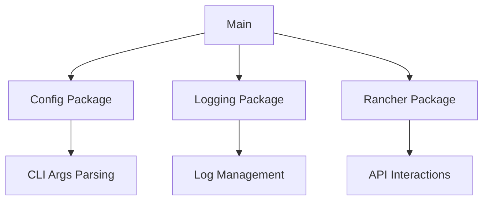

# System Patterns: Rancher Projects

## Architecture Overview
The Rancher Projects tool follows a modular architecture with clear separation of concerns:

## Core Components

### Main Application
- Entry point for the application
- Coordinates flow between different packages
- Handles high-level error management

### Configuration (pkg/config)
- Parses and validates command-line arguments
- Provides configuration structure to other components
- Handles help and usage information

### Logging (pkg/logging)
- Centralized logging setup and configuration
- Consistent log formatting across the application
- Different log levels for appropriate detail

### Rancher API Integration (pkg/rancher)
- Manages authentication and API interactions
- Implements core functionality for project and namespace operations
- Handles both single-cluster and multi-cluster workflows

### Version Control (pkg/version)
- Maintains version information
- Provides build metadata
- Enables runtime version reporting

## Design Patterns

### Dependency Injection
- Configuration is initialized once and passed to components
- Allows for easier testing and component isolation

### Command Pattern
- CLI arguments define operations to execute
- Operations are executed through appropriate handlers

### Repository Pattern
- API interactions are abstracted from business logic
- Enables potential future changes to underlying APIs

### Factory Pattern
- Central logging setup creates and configures logger instances
- Ensures consistent logging behavior

## Error Handling Strategy
- Structured error propagation
- Clear error messages for user feedback
- Graceful termination on critical errors

## Configuration Management
- Command-line driven configuration
- No persistent configuration storage
- Flag-based behavior control

## Testing Approach
- Unit tests for core functionality
- Dependency injection to facilitate testing
- Potential for integration tests with mock Rancher API
